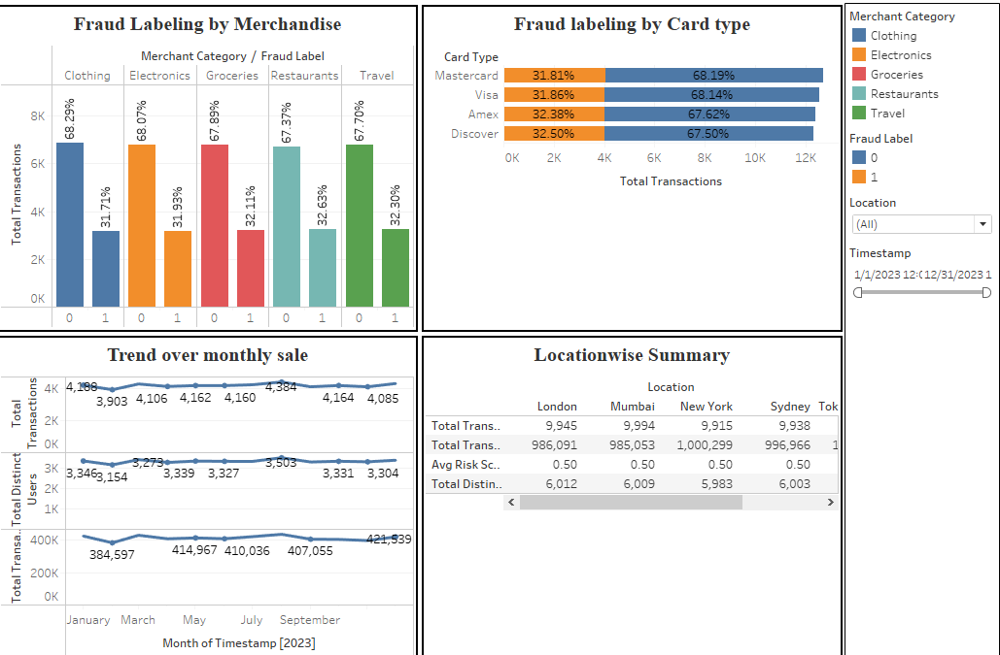

## Live Dashboard
🔗 View on Tableau Public: 
https://public.tableau.com/app/profile/bharati.kalambe/viz/FradulentDashbaord/RetailFraudDetection?publish=yes&showOnboarding=true

# Fraud Monitoring Dashboard

## Overview
This project analyzes transaction-level data to monitor fraud risk, identify suspicious patterns,
and support proactive fraud detection using data visualization.

## Tools & Skills
- Machine Learning: K-Nearest Neighbors (KNN), Logistic Regression, XGBoost
- Programming: Python
- Data Processing & Analysis: Pandas, NumPy
- Model Evaluation: Classification metrics, model comparison
- Data Visualization: Tableau (Interactive dashboards, fraud pattern analysis)
- Analytics Domains: Retail Analytics, Fraud Detection, Risk Analytics
- Business Skills: Analytical thinking, data storytelling, stakeholder-focused insights

## Business Use Case
This dashboard enables fraud and risk teams to quickly detect anomalies, monitor high-risk activity,
and make faster, data-driven decisions to reduce financial losses.

## Output
- Dashboard screenshots
- Packaged visualization files
 
## Key Insights
- Built a machine learning–driven fraud detection framework to identify high-risk retail transactions.
- Compared multiple classification models and identified tree-based models as most effective for fraud prediction.
- Visualized fraud patterns across transaction amount, customer behavior, and product categories using Tableau.
- Identified clear behavioral signals differentiating fraudulent vs. non-fraudulent transactions.
- Enabled faster fraud monitoring through interactive dashboards designed for business and risk teams.
- Demonstrated how combining ML outputs with visualization improves interpretability for non-technical stakeholders.

## Dashboard Preview

